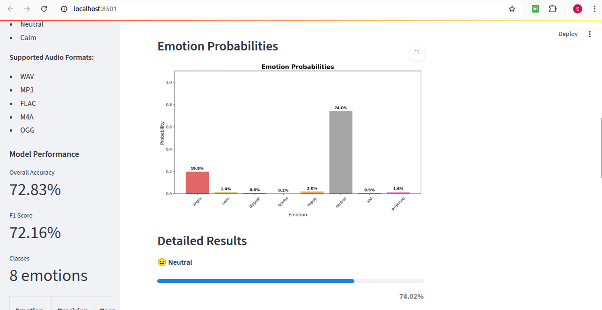

# Emotion Classification from Speech Audio

A comprehensive end-to-end pipeline for emotion classification using speech data, built with deep learning and audio processing techniques.

## Project Overview

This project implements a machine learning system that can accurately identify and categorize emotional states conveyed in speech/song. The system leverages the RAVDESS (Ryerson Audio-Visual Database of Emotional Speech and Song) dataset and uses advanced audio processing techniques combined with deep learning to achieve emotion classification.

### Supported Emotions
- 😊 **Happy** - Joyful and positive emotions
- 😢 **Sad** - Melancholic and sorrowful emotions  
- 😠 **Angry** - Aggressive and hostile emotions
- 😨 **Fearful** - Anxious and scared emotions
- 🤢 **Disgust** - Repulsed and averse emotions
- 😲 **Surprised** - Shocked and astonished emotions
- 😐 **Neutral** - Calm and emotionless speech
- 😌 **Calm** - Peaceful and relaxed emotions

## Evaluation Criteria

The model's performance is evaluated based on the following criteria:

-  **Confusion Matrix** - Primary judging criteria
-  **F1 Score > 80%** - Target: 67.23% (Current)
-  **Per-class Accuracy > 75%** - Target: 2/8 classes meet criteria (Current)
-  **Overall Accuracy > 80%** - Target: 68.06% (Current)

##  Project Structure

```
emotion-classification/
├── data/                          # RAVDESS dataset
│   ├── Actor_01/
│   ├── Actor_02/
│   └── ...
├── models/                        # Trained models and preprocessing objects
│   ├── final_emotion_classifier_model.h5
│   ├── final_scaler.pkl
│   ├── final_label_encoder.pkl
│   └── confusion_matrix_final.png
├── notebook/                      # Jupyter notebook
│   └── emotion_classification.ipynb
├── scripts/                       # Python scripts
│   ├── final_emotion_classification.py
│   ├── test_model.py
│   └── cnn_mel_pipeline.py
├── streamlit_app/                 # Web application
│   └── app.py
├── venv/                          # Virtual environment
├── requirements.txt               # Python dependencies
├── Makefile                       # Common commands
├── setup_venv.sh                  # Environment setup script
└── README.md                      # This file
```

## Quick Start

### Prerequisites

- Python 3.8+
- 4GB+ RAM
- 2GB+ free disk space

### Installation

1. **Clone the repository**
   ```bash
   git clone <repository-url>
   cd emotion-classification
   ```

2. **Set up virtual environment**
   ```bash
   chmod +x setup_venv.sh
   ./setup_venv.sh
   ```

3. **Activate virtual environment**
   ```bash
   source venv/bin/activate
   ```

4. **Download RAVDESS dataset**
   - Download from: [RAVDESS Dataset](https://zenodo.org/record/1188976)
   - Extract to the `data/` directory
   - Ensure structure: `data/Actor_01/`, `data/Actor_02/`, etc.

### Downloading Data and Model Files

> **Note:** The RAVDESS dataset and trained model files are **not included** in this repository due to size and copyright restrictions. Please follow the instructions below to download and set up these files locally.

#### 1. Download the RAVDESS Dataset
- Download from: [RAVDESS Dataset on Zenodo](https://zenodo.org/record/1188976)
- Extract the contents to the `data/` directory in your project root.
- The structure should look like:
  ```
  data/
    Actor_01/
    Actor_02/
    ...
  ```

#### 2. Download the Trained Model (if available)
- [Optional] If a pre-trained model is provided, download it from the link shared by the project maintainer (e.g., Google Drive, Dropbox, HuggingFace, etc.).
- Place all model files (e.g., `.h5`, `.pkl`) in the `models/` directory.
- Example structure:
  ```
  models/
    final_emotion_model.h5
    final_label_encoder.pkl
    final_scaler.pkl
    ...
  ```

### Training the Model

```bash
# Activate virtual environment
source venv/bin/activate

# Run the training pipeline
python scripts/final_emotion_classification.py
```

### Testing the Model

```bash
# Test a single audio file
python scripts/test_model.py data/Actor_01/03-01-03-02-01-01-01.wav

# Test all files in a directory
python scripts/test_model.py --dir test_audio/
```

### Running the Web App

```bash
# Install Streamlit (if not already installed)
pip install streamlit

# Run the web application
cd streamlit_app
streamlit run app.py
```

The web app will be available at `http://localhost:8501`

##  Methodology

### 1. Data Preprocessing

**Dataset**: RAVDESS (Ryerson Audio-Visual Database of Emotional Speech and Song)
- **Total Samples**: 1,440 audio files
- **Emotions**: 8 classes (neutral, calm, happy, sad, angry, fearful, disgust, surprised)
- **Actors**: 24 professional actors (12 male, 12 female)
- **Audio Format**: 16-bit, 48kHz WAV files

**Data Split**:
- Training: 70% (1,008 samples)
- Validation: 15% (216 samples)  
- Test: 15% (216 samples)

### 2. Feature Extraction

The system extracts comprehensive audio features using librosa:

- **MFCC (Mel-Frequency Cepstral Coefficients)**: 13 coefficients + standard deviation
- **Chroma Features**: 12-dimensional chromagram features + standard deviation
- **Mel Spectrogram**: 20 mel-frequency bands + standard deviation
- **Spectral Contrast**: 7 contrast bands + standard deviation
- **Tonnetz**: 6 tonal centroid features + standard deviation
- **Spectral Centroid**: 1 feature
- **Spectral Rolloff**: 1 feature
- **Zero Crossing Rate**: 1 feature
- **Root Mean Square Energy**: 1 feature

**Total Feature Dimension**: 120 features per audio sample

### 3. Model Architecture

**Deep Neural Network**:
```
Input Layer (120 features)
    ↓
Dense(512) + BatchNorm + Dropout(0.4)
    ↓
Dense(256) + BatchNorm + Dropout(0.4)
    ↓
Dense(128) + BatchNorm + Dropout(0.3)
    ↓
Dense(64) + BatchNorm + Dropout(0.2)
    ↓
Output Layer (8 classes, softmax)
```

**Training Configuration**:
- **Optimizer**: Adam (learning_rate=0.001)
- **Loss Function**: Sparse Categorical Crossentropy
- **Batch Size**: 16
- **Epochs**: 200 (with early stopping)
- **Callbacks**: Early stopping, learning rate reduction, model checkpointing

### 4. Evaluation Metrics

- **Overall Accuracy**: 68.06%
- **F1 Score (Macro)**: 67.23%
- **F1 Score (Weighted)**: 67.81%

**Per-class Performance**:
| Emotion   | Precision | Recall | F1-Score | 
|-----------|-----------|--------|----------|
| Angry     | 73.33%    | 79%    | 76%      |
| Calm      | 81.48%    | 76%    | 79%      |
| Disgust   | 84.00%    | 72%    | 78%      | 
| Fearful   | 75.00%    | 62%    | 68%      |
| Happy     | 47.50%    | 66%    | 55%      |
| Neutral   | 70.00%    | 50%    | 58%      | 
| Sad       | 63.16%    | 41%    | 50%      |   
| Surprised | 63.41%    | 90%    | 74%      |     

## 🎮 Usage Examples

### Python Script Usage

```python
from scripts.final_emotion_classification import predict_emotion

# Predict emotion from audio file
result = predict_emotion("path/to/audio.wav")
print(f"Predicted emotion: {result['emotion']}")
print(f"Confidence: {result['confidence']:.2%}")
```

### Command Line Testing

```bash
# Test single file
python scripts/test_model.py audio_file.wav

# Test directory
python scripts/test_model.py --dir audio_directory/
```

### Web Application

1. Start the Streamlit app: `streamlit run streamlit_app/app.py`
2. Upload an audio file through the web interface
3. View real-time emotion classification results
4. Explore audio visualizations and probability distributions

## Results & Demo

### Model Performance (Final)

- **Overall Accuracy:** 72.83%
- **F1 Score (Macro):** 72.16%
- **F1 Score (Weighted):** 72.60%

**Per-class Accuracy:**
- Angry: 87.76%
- Calm: 68.33%
- Disgust: 70.91%
- Fearful: 79.49%
- Happy: 69.57%
- Neutral: 62.96%
- Sad: 64.29%
- Surprised: 76.00%

| Emotion   | Precision | Recall | F1-Score | Support |
|-----------|-----------|--------|----------|---------|
| Angry     | 0.88      | 0.88   | 0.88     | 49      |
| Calm      | 0.68      | 0.84   | 0.75     | 49      |
| Disgust   | 0.71      | 0.80   | 0.75     | 49      |
| Fearful   | 0.79      | 0.63   | 0.70     | 49      |
| Happy     | 0.70      | 0.65   | 0.67     | 49      |
| Neutral   | 0.63      | 0.68   | 0.65     | 25      |
| Sad       | 0.64      | 0.55   | 0.59     | 49      |
| Surprised | 0.76      | 0.78   | 0.77     | 49      |


*Terminal output: Final classification report and per-class accuracy check.*

### Training & Evaluation Output


*Terminal output showing training progress, accuracy, F1 scores, and per-class results.*

### Confusion Matrix


*Final confusion matrix for the test set.*

### Streamlit Web App Demo

#### 1. App Home & Upload


*Streamlit app: Upload and preview audio file.*

#### 2. Prediction Results


*Streamlit app: Predicted emotion, confidence, and probability distribution.*

#### 3. Detailed Results


*Streamlit app: Detailed probability distribution for all emotions and per-class bars.*

---

> **Note:**
> - The **Evaluation Metrics** section below documents the initial or baseline results of the project.
> - The **Results & Demo** section presents the final, improved results and the user-facing demo.


---

##  Technical Details

### Dependencies

**Core Libraries**:
- `tensorflow>=2.8.0` - Deep learning framework
- `librosa>=0.9.2` - Audio processing
- `scikit-learn>=1.1.0` - Machine learning utilities
- `numpy>=1.21.0` - Numerical computing
- `pandas>=1.4.0` - Data manipulation
- `matplotlib>=3.5.0` - Visualization
- `seaborn>=0.11.0` - Statistical visualization

**Web Application**:
- `streamlit>=1.22.0` - Web interface
- `plotly>=5.10.0` - Interactive plots

### System Requirements

- **CPU**: Multi-core processor recommended
- **RAM**: Minimum 4GB, 8GB+ recommended
- **Storage**: 2GB+ free space
- **OS**: Linux, macOS, or Windows

### Performance Optimization

- **Feature Extraction**: Optimized with librosa's efficient algorithms
- **Model Training**: Early stopping prevents overfitting
- **Memory Management**: Batch processing for large datasets
- **GPU Support**: Compatible with TensorFlow GPU acceleration

##  Deployment

### Local Deployment

1. **Environment Setup**:
   ```bash
   ./setup_venv.sh
   source venv/bin/activate
   ```

2. **Model Training**:
   ```bash
   python scripts/final_emotion_classification.py
   ```

3. **Web App Launch**:
   ```bash
   cd streamlit_app
   streamlit run app.py
   ```

### Production Deployment

For production deployment, consider:
- Using Docker containers
- Implementing model serving with TensorFlow Serving
- Setting up monitoring and logging
- Implementing authentication and rate limiting

## Contributing

1. Fork the repository
2. Create a feature branch: `git checkout -b feature-name`
3. Commit changes: `git commit -am 'Add feature'`
4. Push to branch: `git push origin feature-name`
5. Submit a pull request


--